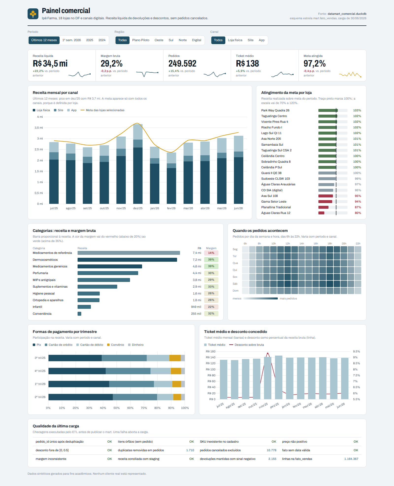
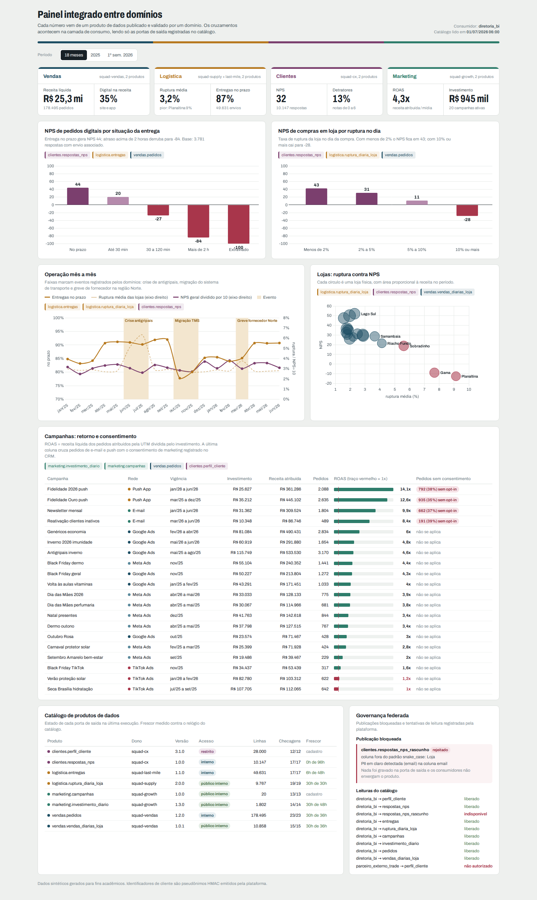

# Ipê Farma · Data Mart e Data Mesh

Comparação prática entre duas arquiteturas de dados analíticos — Data Mart e Data Mesh — implementadas sobre o mesmo cenário sintético: uma rede fictícia de 18 farmácias no Distrito Federal. Atividade da disciplina de Ciência de Dados e Machine Learning (UniCEUB).

**[▶ Painel comercial (Data Mart)](./dashboard_datamart.html)** 
**[▶ Painel integrado entre domínios (Data Mesh)](./dashboard_datamesh.html)**




## Conteúdo do repositório

| Arquivo / pasta | Descrição |
|---|---|
| `dashboard_datamart.html` | Painel comercial do Data Mart (HTML + Chart.js, sem dependências externas). Filtros de período, região e canal recalculam todos os indicadores. |
| `dashboard_datamesh.html` | Painel integrado entre domínios do Data Mesh (HTML + Chart.js). Mostra cruzamentos entre produtos de dados de vendas, logística, clientes e marketing. |
| `dashboard_datamart.png` | Captura estática do painel comercial em alta resolução, estado padrão. |
| `dashboard_datamesh.png` | Captura estática do painel integrado em alta resolução, estado padrão. |
| `Relatorio_DataMart_DataMesh.pdf` | Relatório completo: conceitos, esquemas de implementação, geração dos dados sintéticos, dashboards e análise. |
| `codigo/` | Geradores de dados sintéticos, ETL e SQL do Data Mart, plataforma/contratos/pipelines do Data Mesh e scripts que constroem os dois dashboards. |

## Sobre os dados

Dados 100% sintéticos, com semente fixa para reprodutibilidade, simulando a Ipê Farma — 18 farmácias no DF, um centro de distribuição, ~28 mil clientes e 420 produtos — entre janeiro de 2024/2025 e junho de 2026, conforme a arquitetura.

**Data Mart:** um time central integra as fontes operacionais (PDV, ERP, CRM, Planejamento) em um modelo dimensional único (`fato_vendas`, `fato_meta_mensal` e 7 dimensões), carregado em DuckDB com portões de qualidade no ETL.

**Data Mesh:** quatro domínios (vendas, logística, clientes, marketing) publicam seus próprios produtos de dados, cada um com contrato, dono, SLA e regras de qualidade, validados por uma plataforma self-serve e cruzados apenas no consumo, via um identificador global pseudonimizado (HMAC-SHA256).

Regras de negócio embutidas na geração (não é ruído aleatório uniforme): sazonalidade mensal e por Black Friday/Natal, porte e tendência por loja, migração de canais digitais, ruptura de estoque com eventos pontuais (crise de antigripais, greve de fornecedor), atrasos de entrega ligados a chuva e migração de sistema, e campanhas de marketing com ROAS e consentimento de LGPD.

## Dashboards — composição

| Painel | Foco | Por quê |
|---|---|---|
| Data Mart · Comercial | KPIs, receita mensal por canal, atingimento de meta por loja | Leitura executiva rápida para a diretoria comercial, com filtros de período, região e canal |
| Data Mart · Comercial | Receita e margem por categoria, mapa de calor de pedidos | Mostra onde o mix de produtos ajuda ou prejudica a margem, e quando a demanda se concentra |
| Data Mesh · Integrado | NPS por situação da entrega e por ruptura de estoque | Cruza produtos de clientes, logística e vendas para explicar causas que um único domínio não vê sozinho |
| Data Mesh · Integrado | Retorno de campanhas (ROAS) e pedidos sem consentimento | Cruza marketing com o CRM para expor risco de LGPD que nenhum domínio enxergava isolado |
| Data Mesh · Integrado | Catálogo de produtos e governança federada | Mostra publicações aprovadas, uma publicação bloqueada por PII e um acesso negado a consumidor não autorizado |

## Como usar

**Local:** clone o repositório e abra os arquivos `.html` direto no navegador — não precisa de servidor, build ou instalação.

```bash
git clone https://github.com/rafael-robsonn/Dashboard-BI_2.git
cd Dashboard-BI_2
open dashboard_datamart.html   # macOS
open dashboard_datamesh.html
# ou apenas dê duplo clique nos arquivos
```

**GitHub Pages:** em Settings → Pages, selecione a branch `main` e a pasta raiz. Os painéis ficam acessíveis publicamente em `https://<usuario>.github.io/<repo>/dashboard_datamart.html` e `.../dashboard_datamesh.html`.

**Reproduzir os dados e o ETL:** requer Python 3.11+ com `pandas`, `numpy`, `duckdb`, `pyarrow` e `pyyaml`. Veja o passo a passo em [`codigo/README.md`](./codigo/README.md).

## Stack

HTML + CSS + JavaScript puro, [Chart.js](https://www.chartjs.org/) para os gráficos nos dashboards. DuckDB, pandas e Parquet no pipeline de dados (Python). Sem framework, sem bundler, sem dependência de rede em tempo de execução dos painéis.

## Licença dos dados

Dados 100% sintéticos, gerados para fins acadêmicos. Nenhuma informação real de clientes, farmácias ou empresas.
